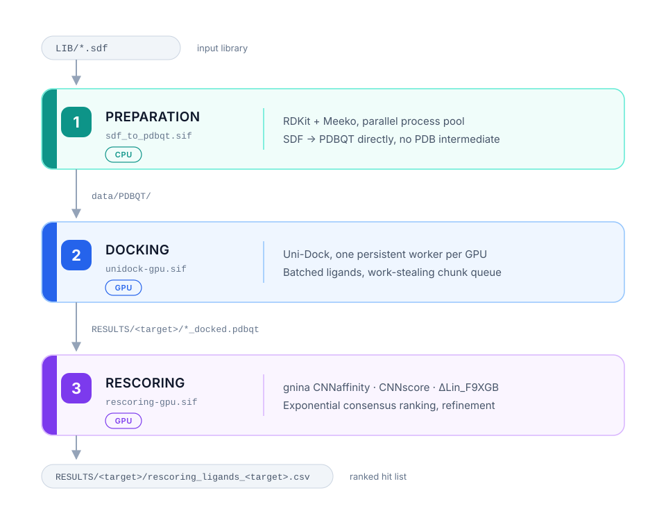

<!--
  VOR DEM OEFFENTLICHSCHALTEN NOCH OFFEN:
    1. Abschnitt License → Lizenz waehlen, siehe THIRD_PARTY.md
    2. Abschnitt Contact → Name, Institution (optional)
    3. CITATION.cff → authors, license
    4. Abschnitt Validation → nach dem DUD-E-Lauf mit Zahlen ersetzen
-->

# kepler-dock-cascade


Multi-GPU pipeline for structure-based virtual screening.

Ligand preparation, docking and consensus rescoring run as three separate
Apptainer containers, each with its own configuration and entry point. Stages
can be run individually or in sequence. The docking stage resumes from where it
stopped after a crash or a wall-clock limit.

Docking uses [Uni-Dock](https://github.com/dptech-corp/Uni-Dock), rescoring uses
[gnina](https://github.com/gnina/gnina).

---

## Overview

<picture>
  <source media="(prefers-color-scheme: dark)" srcset="docs/pipeline-dark.svg">
  
</picture>

Each stage is a separate Apptainer image with a disjoint dependency set. The
preparation container has no CUDA, the docking container has no scoring stack,
and the rescoring container has no ligand-preparation tooling.

---

## Design notes

**Direct SDF to PDBQT conversion.** PDB has no bond records, so the common
SDF → PDB → PDBQT route loses bond orders and the receiving tool reconstructs
connectivity from interatomic distances. That misassigns bonds for unfavourable
conformers. RDKit reads bond orders from the SDF, Meeko writes PDBQT without the
PDB step.

**Batched docking.** Ligands go to Uni-Dock in batches, not one process per
ligand. Receptor parsing, grid-map construction and GPU context setup happen
once per batch instead of once per molecule. On out-of-memory the batch is
halved and retried, so one oversized ligand does not cost the whole chunk.

**Work-stealing across GPUs.** Targets are assigned to GPUs. A GPU that finishes
its target early takes chunks from other targets' queues rather than idling.

**Filesystem as state.** Progress is derived from `*_docked.pdbqt` files and
`.done` markers, not from a database or an in-memory job table. A restart
recomputes the remaining work from what is on disk, so any form of abrupt
termination is recoverable.

**Hang protection in the rescoring container.** Apptainer containers have no
PID 1 init to reap children. With parallel workers, `SIGCHLD` can be lost and
`os.system` then blocks in `wait()` indefinitely. The MSMS and MGLTools call
sites use `subprocess` with timeouts, `start_new_session` and process-group
kills instead. The container build checks by AST inspection that no `os.system`
call remains.

---

## Requirements

- Linux with NVIDIA GPUs, compute capability ≥ 7.0
- NVIDIA driver with CUDA 12.x support
- [Apptainer](https://apptainer.org/) ≥ 1.2
- Python 3.10+ on the host (for the orchestrator and pre-flight checks)

Verified on 4 × NVIDIA H100 (sm_90).

---

## Installation

```bash
git clone https://github.com/roessel-cmd/kepler-dock-cascade.git
cd kepler-dock-cascade
```

The `gnina` binary is not distributed here. Download it from the
[gnina releases](https://github.com/gnina/gnina/releases) and place it in
`build/` before building the rescoring image.

Build the three containers:

```bash
cd build/

# Stage 1
cp ../src/sdf_to_pdbqt.py .
apptainer build ../sdf_to_pdbqt.sif sdf_to_pdbqt.def

# Stage 2
cp ../src/{pipeline_common.py,docking_config.py,unidock_engine.py} .
cp ../src/{worker_dock.py,worker_restart_dock.py} .
apptainer build ../unidock-gpu.sif unidock-gpu.def

# Stage 3 — gnina must already be in build/
cp ../src/{worker_rescore.py,docking_rescore.py,gnina_refinement.py} .
cp ../src/{gnina_gpu_worker.py,linf9xgb_scorer.py,ecr.py} .
apptainer build ../rescoring-gpu.sif rescoring-gpu.def
```

On sites where the `fakeroot` command is present but unusable — a common setup
on shared clusters — add `--ignore-fakeroot-command` to each `apptainer build`:

```bash
apptainer build --ignore-fakeroot-command ../unidock-gpu.sif unidock-gpu.def
```

Apptainer resolves `%files` relative to the working directory, so the modules
have to be copied into `build/` before each build. Rather than tracking that by
hand, check it:

```bash
cd build/
for d in sdf_to_pdbqt.def unidock-gpu.def rescoring-gpu.def; do
  echo "--- $d"
  sed -n '/^%files/,/^%[a-z]/p' "$d" | grep -oE '^\s+\S+' | tr -d ' ' | \
  while read -r f; do [ -e "$f" ] && echo "  ok    $f" || echo "  FEHLT $f"; done
done
```

Every entry has to resolve before you start a build. A missing file aborts the
build after the base image has already been pulled, which on a slow connection
costs more time than the check.

Verify that the Uni-Dock build supports your GPU architecture before anything
else:

```bash
apptainer exec --nv unidock-gpu.sif bash -c \
  'source /opt/miniconda3/etc/profile.d/conda.sh && conda activate docking_env && unidock --help'
```

If this reports `no kernel image is available for execution on the device`, the
packaged binary does not cover your compute capability. Build Uni-Dock from
source in `%post` with `CMAKE_CUDA_ARCHITECTURES` set accordingly.

---

## Usage

Define your receptors in `TARGET/config.txt`:

```
BRD4
CENTER [12.5, -8.3, 22.1]
BOX_SIZE [25.0, 25.0, 25.0]

CDK2
CENTER [4.1, 15.7, -3.2]
BOX_SIZE [22.0, 22.0, 22.0]
LIGAND_SUBDIR = cdk2_dude
```

Each block needs a `<name>.pdbqt` in `TARGET/`. `LIGAND_SUBDIR` restricts a
target to its own ligand subset, which is what the DUD-E validation runs use.

Place your library as one or more `.sdf` files in `LIB/`, then:

```bash
python3 src/check_config.py config/    # configuration consistency
./pipeline_start.sh --dry-run          # show every command without running it
./pipeline_start.sh
```

Stages are toggled at the top of `pipeline_start.sh`:

```bash
RUN_CONVERSION=true
RUN_DOCKING=true
RUN_RESCORING=true
```

Re-ranking with different consensus weights needs no re-docking: set
`RUN_CONVERSION=false` and `RUN_DOCKING=false`, adjust the `w_*` values in
`config/rescore.ini`, run again.

Changing only the weights does not even need the scoring to run again. With
`rescore_block_size > 0` the raw scores are kept in
`RESULTS/<target>/.rescore_partial/`, and `rescore_rank.py` recomputes the
ranking from them on the host — no container, no GPU, seconds instead of hours:

```bash
python3 src/rescore_rank.py RESULTS/BRD4
python3 src/rescore_rank.py RESULTS/BRD4 --weights vina=0.2,cnnscore=0.5,cnnaffinity=0.3
python3 src/rescore_rank.py RESULTS/BRD4 --sigma-fraction 20 --out ranking_sharp.csv
```

Each output carries a comment header with the weights, `sigma`, the active
functions and the git revision, so two rankings from two weightings stay
distinguishable later.

To resume an interrupted docking run:

```bash
./pipeline_start.sh --restart
```

---

## Configuration

Three configuration surfaces: the switches at the top of `pipeline_start.sh`,
`config/docking.ini`, and `config/rescore.ini`. Stage 1 has no INI; it is
configured through the `CONV_*` variables in the shell script.

Every option is listed below with its default. Options absent from an INI fall
back to the value shown, except where marked required.

### pipeline_start.sh

| Variable | Default | Effect |
|---|---|---|
| `RUN_CONVERSION` | `true` | Run stage 1 |
| `RUN_DOCKING` | `true` | Run stage 2 |
| `RUN_RESCORING` | `true` | Run stage 3 |
| `CHECK_CONFIG` | `true` | Run `check_config.py` before stage 1 |
| `CHECK_LIGANDS` | `true` | Run `check_ligands.py` between stage 1 and 2 |
| `CONTINUE_ON_ERROR` | `false` | Continue after a failed stage instead of aborting |
| `CONV_SIF` | `sdf_to_pdbqt.sif` | Stage 1 container |
| `CONV_LIB_DIR` | `LIB` | Directory scanned for input files |
| `CONV_INPUT_TYPES` | `sdf` | `sdf`, `smiles`, or `all`. Which file types are collected from `LIB/` |
| `CONV_SMILES_COL` | *(empty)* | SMILES column, header name or 0-based index. Empty means autodetect |
| `CONV_NAME_COL` | *(empty)* | Name column, same convention |
| `CONV_OUT_DIR` | `data/PDBQT` | PDBQT output. Must match `[PATHS] pdbqt_dir` |
| `CONV_WORKERS` | `15` | Parallel conversion processes |
| `CONV_TIMEOUT` | `120` | Seconds per molecule before SIGALRM |
| `CONV_UFF_ITERS` | `800` | UFF optimisation steps per molecule |
| `CONV_FLAT` | `false` | `true` writes all PDBQTs into one directory |
| `CONV_SUBDIR_PER_SDF` | `true` | One output subdirectory per input SDF |
| `CONV_RESUME` | `true` | Pass `--skip-existing` to the converter: molecules whose PDBQT already exists are skipped individually |
| `CONV_SKIP_IF_COMPLETE` | `true` | Skip an SDF entirely once converted + failed ≥ molecules in the file |
| `DOCK_SIF` | `unidock-gpu.sif` | Stage 2 container |
| `DOCK_INI` | `config/docking.ini` | Stage 2 configuration |
| `DOCK_RESTART` | `false` | Use `restart_orchestrator.py`; also set by `--restart` |
| `RESCORE_SIF` | `rescoring-gpu.sif` | Stage 3 container |
| `RESCORE_INI` | `config/rescore.ini` | Stage 3 configuration |

Command line: `--dry-run` prints every command without executing it, `--restart`
sets `DOCK_RESTART=true`, `--help` prints the header.

### config/docking.ini

**`[PATHS]`.** All four are required. A missing key fails at startup with
`KeyError`. Relative paths resolve against the project directory.

| Key | Purpose |
|---|---|
| `pdbqt_dir` | Ligand PDBQTs from stage 1. Searched recursively |
| `target_dir` | Receptor PDBQTs and `config.txt` |
| `results_dir` | Poses and per-chunk CSVs. Handover to stage 3 |
| `log_dir` | `pipeline.log`, chunk files, job directories |

**`[GPU]`**

| Key | Default | Effect |
|---|---|---|
| `num_gpus` | `1` | Number of GPUs used. The first N reported by `nvidia-smi` |
| `cuda_device_id` | `0` | Which GPU to use when `num_gpus = 1`. Ignored otherwise |

**`[UNIDOCK]`.** These map directly to Uni-Dock CLI flags.

| Key | Default | Effect |
|---|---|---|
| `binary` | `unidock` | Path or command name of the Uni-Dock executable |
| `search_mode` | `balance` | `fast`, `balance`, or `detail`. Empty string enables `exhaustiveness` and `max_step` |
| `exhaustiveness` | `384` | Monte Carlo runs. Only read when `search_mode` is empty |
| `max_step` | `0` | Steps per run. Only read when `search_mode` is empty; `0` omits the flag |
| `num_modes` | `9` | Poses written per ligand |
| `energy_range` | `3` | kcal/mol window below the best pose |
| `scoring` | `vina` | `vina`, `vinardo`, or `ad4`. `ad4` requires precomputed AutoGrid maps |
| `batch_size` | `1000` | Ligands per Uni-Dock process. Main lever for GPU utilisation |
| `max_gpu_memory` | `0` | MB cap. `0` means no cap. Set to about 75% of VRAM if OOM occurs |
| `timeout` | `7200` | Seconds per sub-batch. `0` disables the timeout |
| `refine_step` | `0` | Uni-Dock refinement steps. `0` omits the flag |
| `seed` | `0` | Random seed. `0` means non-deterministic |

**`[CHUNK]`**

| Key | Default | Effect |
|---|---|---|
| `chunk_size` | `5000` | Ligands per dispatch unit: one job file, one chunk CSV |

`chunk_size` and `batch_size` are different units. A chunk of 5000 runs as five
sub-batches of 1000 inside one worker. Larger chunks reduce dispatch overhead;
smaller chunks distribute the tail of a target more evenly across GPUs.

### config/rescore.ini

**`[PATHS]`.** `target_dir`, `results_dir` and `log_dir`, all required.
`results_dir` and `target_dir` must match the values in `docking.ini`;
`check_config.py` verifies this.

**`[GPU]`.** Same two keys as in `docking.ini`. The orchestrator reads them in
the rescore stage too. Without this section `num_gpus` falls back to 1 and
rescoring runs on a single GPU.

**`[RESCORE]`, scoring functions.** Each is switched on and weighted separately. At least one must be active.

| Key | Default | Score | Direction |
|---|---|---|---|
| `vina_enabled` | `true` | From `REMARK VINA RESULT` in the pose file. No extra cost | smaller better |
| `vinardo_enabled` | `false` | `gnina --score_only --scoring vinardo`. One extra pass per ligand | smaller better |
| `ad4_enabled` | `false` | `gnina --score_only --scoring ad4_scoring`. One extra pass per ligand | smaller better |
| `cnnaffinity_enabled` | `false` | gnina CNNaffinity, predicted pK | larger better |
| `cnnscore_enabled` | `false` | gnina CNNscore, pose quality in [0,1] | larger better |
| `deltalinf9xgb_enabled` | `false` | Lin_F9 + XGBoost, separate conda env | larger better |
| `dense_enabled` | `false` | Second CNN model, adds `dense_cnnaffinity` and `dense_cnnscore` | larger better |

`vina_enabled` reads the value the docking used. With `[UNIDOCK] scoring = vinardo`
the column `score_vina` holds Vinardo values; `check_config.py` warns about this.

**The CNN switches gate the computation, not just the ranking.** Each of
`cnn_model` and `dense_model` is one forward pass over every pose, and one model
always produces both of its outputs — affinity and score — at the cost of one.
Which of them enters the ranking is decided by the weights, not by these
switches:

| `cnnaffinity` / `cnnscore` | `dense_enabled` | Models run |
|---|---|---|
| either `true` | `false` | primary only |
| both `false` | `true` | dense only |
| either `true` | `true` | both — twice the GPU time |
| both `false` | `false` | none |

Before August 2026 the primary model ran unconditionally and these flags only
controlled whether its values were counted, so `dense_enabled = true` with both
primary flags off ran two models instead of one.

**`[RESCORE]`, consensus weights.** All zero means equal weighting over the
active functions. Otherwise weights normalise to 1 over the active set.

| Key | Default |
|---|---|
| `w_vina` | `0.0` |
| `w_vinardo` | `0.0` |
| `w_ad4` | `0.0` |
| `w_cnnaffinity` | `0.0` |
| `w_cnnscore` | `0.0` |
| `w_deltalinf9xgb` | `0.0` |
| `w_dense_cnnaffinity` | `0.0` |
| `w_dense_cnnscore` | `0.0` |

**`[RESCORE]`, execution.**

| Key | Default | Effect |
|---|---|---|
| `enabled` | `true` | Master switch for the whole stage |
| `sigma_fraction` | `4.0` | Decay parameter of the consensus. Larger means sharper decay |
| `cnn_model` | `crossdock_default2018_ensemble` | gnina CNN model |
| `dense_model` | `dense_ensemble` | Second model, used when `dense_enabled` |
| `gnina_binary` | *(empty)* | Path to gnina. Empty falls back to autodetection via PATH |
| `gnina_use_gpu` | `true` | `false` forces `--no_gpu` |
| `n_jobs` | `1` | joblib workers for the CLI path. `-1` uses all cores |
| `rescore_batch_size` | `0` | Poses per GPU batch. `0` derives it from available VRAM. On out-of-memory the batch is halved and retried, so an oversized value costs time rather than data |
| `rescore_block_size` | `0` | Ligands per resumable block. `0` disables blocking. See below |
| `min_block_coverage` | `0.99` | Fraction of a block's poses that must carry a score before the block is saved. Below it the run aborts instead of writing a block with gaps |
| `cluster_poses` | `false` | RMSD clustering before scoring, reduces the number of poses |
| `cluster_rmsd_cutoff` | `2.0` | Ångström threshold for clustering |
| `deltalinf9xgb_n_workers` | `1` | Scoring workers for ΔLin_F9XGB |
| `deltalinf9xgb_prep_workers` | `0` | MOL2 preparation workers. `0` mirrors `n_workers` |
| `rescore_num_gpus` | `0` | GPUs for rescoring. `0` uses the `[GPU]` setting |
| `rescore_cuda_device_id` | `0` | Which GPU when `rescore_num_gpus = 1` |

**Resumable rescoring.** With `rescore_block_size > 0` the ligand list is cut
into blocks. Each block is scored in full and written to
`RESULTS/<target>/.rescore_partial/scores_NNNNN.csv` before the next one starts;
a restart skips the blocks already on disk. Without it, a target killed at the
wall clock starts over from the beginning. For HPC runs 2000 is a reasonable
value — the model is reloaded once per block, which is negligible at that size.

`min_block_coverage` guards the same mechanism from the other side. A block that
is missing scores must not be saved: the resume logic would skip it and the loss
would be permanent. Poses without a value receive no rank in the consensus and
contribute zero, so they are penalised rather than treated as neutral — an
incomplete block silently distorts the ranking.

The partial files are also what `rescore_rank.py` reads, so they are worth
keeping after a run finishes.

**`[REFINEMENT]`.** Runs after rescoring on the best-ranked ligands.

| Key | Default | Effect |
|---|---|---|
| `enabled` | `false` | Master switch |
| `top_fraction` | `0.15` | Fraction of the ECR ranking to refine |
| `refinement_mode` | `local_only` | `local_only`, `minimize`, or `autobox` |
| `autobox_extend` | `4.0` | Ångström padding, only for `refinement_mode = autobox` |
| `cnn_model` | `crossdock_default2018_ensemble` | gnina CNN model |
| `exhaustiveness` | `0` | `0` means local optimisation without a new search |
| `num_modes` | `1` | Poses per refined ligand |
| `use_gpu` | `true` | GPU for the refinement runs |
| `gnina_binary` | *(empty)* | Path to gnina, autodetected when empty |

## Running on an HPC cluster

Slurm job scripts, all submitted from the project root:

```bash
sbatch convert.slurm      # stage 1, CPU only, once per library
sbatch dock.slurm         # stage 2 or 3, chains itself past the wall-clock limit
sbatch benchmark.slurm    # throughput measurements, single job
sbatch rescore_test.slurm <target>          # stage 3 on a bounded slice
sbatch archive.slurm <job> [--purge]        # bundle a finished run, then clean up
sbatch cleanup.slurm <dir>.old_<timestamp>  # delete a moved directory
```

Adjust the `#SBATCH` headers to your site: partition names, core counts and
wall-clock limits differ between clusters. All of them abort with a clear
message if submitted from anywhere but the project root, since Slurm runs a copy
of the script from its spool directory and only `SLURM_SUBMIT_DIR` points back
to the repository.

### A full run, start to finish

The stages are separate jobs on purpose: conversion needs no GPU, docking and
rescoring have different wall-clock behaviour, and each of them is worth
checking before the next one starts.

**1. Prepare the library** — once per library, on a CPU partition.

```bash
sbatch convert.slurm
```

Wait for it to finish, then confirm the count is what you expect:

```bash
find data/PDBQT -name '*.pdbqt' | wc -l
python3 src/check_ligands.py data/PDBQT
```

**2. Dock** — the chain runs until nothing is left.

```bash
sbatch dock.slurm
squeue -u $USER            # the current link and its pending successor
```

Each link submits its successor before starting work, so the chain survives
being killed at the wall clock. Check progress at any time, including while a
link is running:

```bash
python3 src/pipeline_progress.py config/docking.ini
```

Exit code 1 means the docking is done. If the run was cut short by a node crash
rather than by the scheduler, check for truncated poses before resuming:

```bash
python3 src/check_poses.py config/docking.ini --since 6
```

**3. Rescore** — same script, different stage switches.

```bash
sbatch --export=ALL,RUN_DOCKING=false,RUN_RESCORING=true dock.slurm
```

Set `rescore_block_size` to a non-zero value in `config/rescore.ini` first,
otherwise nothing is checkpointed and a target interrupted at the wall clock
starts over. Before committing a full target, a bounded slice confirms the
configuration does what you think:

```bash
sbatch rescore_test.slurm
python3 src/rescore_progress.py config/rescore.ini
```

**4. Re-rank** — on the host, no job needed.

```bash
python3 src/rescore_rank.py RESULTS/<target> --weights vina=0.5,cnnscore=0.5
```

**5. Archive and clean up.**

```bash
sbatch archive.slurm dock-76523 --dry-run
sbatch archive.slurm dock-76523 --purge
```

The archive job submits the deletion job itself once the tarball verifies, so
this step needs no further attention.

A pattern worth keeping: each stage has a counter that answers "is this done?"
without reading logs — `pipeline_progress.py` for docking, `rescore_progress.py`
for rescoring. Both exit 1 when there is nothing left, which is also how
`dock.slurm` decides to stop chaining.

### convert.slurm

Runs stage 1 on a CPU partition. Conversion needs no GPU, and a job holding four
H100s for hours of RDKit work wastes the scarce resource. Worker count is taken
from `SLURM_CPUS_PER_TASK` rather than the default 15, minus one core for the
producer that streams the SDF. `check_ligands.py` runs once at the end.

Interrupted runs resume: resubmit and the converter skips molecules whose PDBQT
already exists.

### dock.slurm

Runs stage 2 and **submits its successor before starting work**, with
`--dependency=afterany`. That ordering matters: a resubmit at the end of the
script is never reached when the job is killed at the wall-clock limit, which is
the normal case for a long screen.

`#SBATCH --signal=B:USR1@600` makes Slurm send `USR1` ten minutes before the
limit. The handler terminates the process group so containers shut down in order
instead of being killed mid-write. The sub-batch in flight is lost and re-docked
by the next job — at most `batch_size` ligands.

The chain stops when nothing is left, when a run made no progress and was not
cut short by the wall clock, or after `CHAIN_MAX` links (default 20). The
remaining work is derived from `RESULTS/<target>/*_docked.pdbqt`, the same
measure the restart orchestrator uses, so the stop condition and the resume
logic cannot disagree.

Conversion and the ligand check are switched off inside the chain: they are
one-off work, and re-scanning a million-file library at every link costs GPU
time for nothing.

```bash
sbatch dock.slurm                          # default chain
CHAIN_MAX=5 sbatch --export=ALL,CHAIN_MAX=5 dock.slurm   # shorter chain
squeue -u $USER                            # see the pending successor
scancel <job-id>                           # cancelling a link stops the chain
```

**The same script chains stage 3.** With `RUN_DOCKING=false` and
`RUN_RESCORING=true` it drives the rescoring instead:

```bash
sbatch --export=ALL,RUN_DOCKING=false,RUN_RESCORING=true dock.slurm
```

The stage switches are passed on to the successor, so a rescoring chain does not
turn back into a docking chain. The progress counter changes with the stage,
because the two produce different artefacts: docking writes one file per ligand,
rescoring writes one block file per few thousand. Running the docking counter
against a finished docking would report "nothing left" and end the chain before
stage 3 ever starts.

| Stage | Counter | Unit | `MIN_PROGRESS` default |
|---|---|---|---|
| docking | `pipeline_progress.py` | ligands | 1000 |
| rescoring | `rescore_progress.py` | blocks | 1 |

Both share the same contract — exit 0 for work remaining, 1 for finished, 2 for
an error, and `--json` carrying a `remaining` key — so the chain logic treats
them identically. `rescore_progress.py` reads `config/rescore.ini`, counts the
expected blocks from the pose files and the saved ones from
`.rescore_partial/`, and refuses to count at all when the saved blocks do not
match the configured block size:

```bash
python3 src/rescore_progress.py config/rescore.ini
python3 src/rescore_progress.py config/rescore.ini --json
```

The wall-clock path demands progress as well: if one unit takes longer than the
wall clock — a `rescore_block_size` set too large — no run ever saves anything,
and the chain would otherwise spin through all `CHAIN_MAX` links doing nothing.

### benchmark.slurm

Runs the benchmark matrix as a single job — deliberately without chaining, since
a measurement split across two jobs may land on different hardware and is not
comparable. Requires `--exclusive`: a shared node means measuring other people's
load.

Before the matrix it records the environment (CPU, GPUs, driver, topology,
container timestamps, Uni-Dock version, git commit) to
`logs/bench-<jobid>-environment.txt`, and verifies that Uni-Dock starts on the
node. Without those details a throughput number is not interpretable.

### Target definition

`TARGET/config.txt` is not an INI. One block per receptor, blocks separated by
blank lines:

```
BRD4
CENTER [12.5, -8.3, 22.1]
BOX_SIZE [25.0, 25.0, 25.0]

CDK2
CENTER [4.1, 15.7, -3.2]
BOX_SIZE [22.0, 22.0, 22.0]
LIGAND_SUBDIR = cdk2_dude
```

| Field | Required | Meaning |
|---|---|---|
| name | yes | First line of the block. Needs a matching `<name>.pdbqt` in `target_dir` |
| `CENTER` | yes | Box centre in Ångström |
| `BOX_SIZE` | yes | Box dimensions in Ångström |
| `LIGAND_SUBDIR` | no | Restricts this target to a subdirectory of `pdbqt_dir` |

Lines starting with `#` are comments. A receptor whose PDBQT is missing produces
a warning and is skipped rather than aborting the run.

## Archiving and cleanup

A finished run leaves millions of files behind. `archive_run.sh` bundles what is
worth keeping into one tarball and then clears the working directories.

```bash
sbatch archive.slurm dock-76523 --dry-run   # show what would happen
sbatch archive.slurm dock-76523             # archive only
sbatch archive.slurm dock-76523 --purge     # archive, then clean up
```

The job name resolves from `dock-76523`, from the bare id `76523`, or from a
path like `logs/dock-76523.out`. `archive/<jobname>.tar.gz` then contains:

```
<jobname>/
├── TARGET/            receptor PDBQTs and config.txt
├── config/            the INIs the run used
├── slurm/             the .out files of that job id
├── LOG/               worker and chunk logs from data/LOG
├── RESULTS/           poses and CSVs
├── rescoring_ligands_<target>.csv
├── Top<N>_<target>.csv
└── MANIFEST.txt       date, host, targets, active configuration
```

| Option | Effect |
|---|---|
| `--purge` | Move `RESULTS/` and `data/LOG/` aside and delete them afterwards |
| `--no-poses` | Keep only the CSVs from `RESULTS/`, not the `_docked.pdbqt` files |
| `--all-logs` | Include the stage 1 conversion logs, which are excluded by default |
| `--top N` | Size of the top list, default 250 |
| `--out DIR` | Target directory for the archive, default `archive/` |
| `--dry-run` | Report only, change nothing |

Conversion logs are left out because stage 1 writes one file per failed molecule
and they belong to the library, not to this run. Docking and rescoring artefacts
are kept.

`MANIFEST.txt` records the configuration the run actually used. Column names
carry only part of that: `score_vina` holds Vinardo values when the docking used
Vinardo, and the weights behind an `ecr_score` are not visible in the CSV at all.
Rankings produced by `rescore_rank.py` carry the same information as a comment
header, which `pandas.read_csv(comment='#')` and `csv.DictReader` both skip.

**Nothing is deleted before the archive verifies.** The tar listing has to
complete and contain the required entries; an archive truncated by a full disk
or a wall-clock kill blocks the cleanup. `--no-poses --purge` is the one
combination that removes data which is provably not in the archive — use it only
when the poses are genuinely disposable.

The deletion runs as its own job. A background `rm` started from inside a Slurm
job does not survive the job ending: Slurm reaps the job step's processes,
`setsid` and `nohup` notwithstanding. `cleanup.slurm` only removes paths
matching `*.old_<timestamp>`, so a stray argument cannot take out `RESULTS` or
`TARGET`.

### Manual cleanup

For clearing a directory without archiving. Rename first, recreate the empty
directory immediately, send the deletion to the background — the pipeline can
write again straight away, while `rm` works through the file count.

**All commands assume the project root as the working directory.** Run from
elsewhere they fail with `No such file or directory`, which here means nothing
was deleted rather than that the work is done.

```bash
cd /path/to/kepler-dock-cascade

mv RESULTS RESULTS.old && mkdir RESULTS
nohup rm -r RESULTS.old > ~/rm_results.log 2>&1 &

mv data/LOG data/LOG.old && mkdir data/LOG
nohup rm -r data/LOG.old > ~/rm_log.log 2>&1 &

mv data/PDBQT data/PDBQT.old && mkdir data/PDBQT
nohup rm -r data/PDBQT.old > ~/rm_pdbqt.log 2>&1 &
```

`data/PDBQT` holds the docking input. Only clear it once every target has
finished docking, or stage 1 has to run again over the whole library.

Checking progress:

```bash
ps -u $USER -o pid,etime,cmd | grep '[r]m -r'   # deletions still running?
ps -u $USER -o pid,etime,cmd                    # everything of yours on this node
squeue -u $USER                                 # your Slurm jobs, any node
find RESULTS.old -type f 2>/dev/null | wc -l    # how much is left
cat ~/rm_results.log                            # errors, should be empty
```

`ps` only sees the node you are logged into; anything running as a Slurm job
lives on a compute node and shows up in `squeue`. `jobs` works only in the shell
that started the process. Avoid `du` here — it reports errors for files `rm`
removes while it counts, which looks alarming and is not.

`-r` rather than `-rf`: `-f` suppresses error messages, and across millions of
files permission or I/O problems are worth seeing.

---

---

## Consensus ranking

Scores from different functions are combined by **exponential consensus ranking**
(Palacio-Rodríguez et al., *Sci Rep* **9**, 5142, 2019). ECR ranks poses per scoring function and
combines the ranks. Scores on incompatible scales, such as a Vina energy in
kcal/mol and a CNN classification score in $[0,1]$, can therefore be combined
without normalisation.

### Step 1 — Direction correction

Every score is normalised so that **smaller is better** before ranking. Functions
that report "larger is better" are negated:

| Score | Raw output | Direction | Stored as |
|---|---|---|---|
| `vina` | kcal/mol | smaller better | $s$ |
| `vinardo` | kcal/mol | smaller better | $s$ |
| `ad4` | kcal/mol | smaller better | $s$ |
| `cnnaffinity` | predicted pK | larger better | $-s$ |
| `cnnscore` | $[0,1]$ | larger better | $-s$ |
| `deltalinf9xgb` | predicted pK$_d$ | larger better | $-s$ |
| `dense_cnnaffinity` | predicted pK | larger better | $-s$ |
| `dense_cnnscore` | $[0,1]$ | larger better | $-s$ |

### Step 2 — Per-score ranking

For each active scoring function $j$, all poses of the target that carry a valid
value are sorted ascending and assigned ranks $r_j \in \{1, 2, \dots\}$, so rank 1
is the best pose under that function. Poses without a value for $j$ receive no
rank and contribute nothing to that term.

### Step 3 — Exponential weighting

$$\mathrm{ECR}_j(\text{pose}) = e^{-r_j / \sigma}, \qquad \sigma = \max\left(\frac{N}{f}, 1\right)$$

with $N$ the total number of poses of the target and $f$ the configurable
`sigma_fraction` (default 4.0). The contribution decays exponentially with rank. A function that places a pose
near the top contributes close to its full weight, one that places it in the
tail contributes close to nothing. Larger $f$ gives smaller $\sigma$ and a
sharper decay, so only the leading ranks carry weight.

### Step 4 — Weighted sum per pose

$$P(\text{pose}) = \sum_{j \in A} w_j \cdot \mathrm{ECR}_j(\text{pose})$$

where $A$ is the set of active functions that actually produced data. Weights are
normalised over $A$ only:

$$w_j = \frac{w_j^{\text{ini}}}{\sum_{k \in A} w_k^{\text{ini}}}
\qquad\text{or}\qquad w_j = \frac{1}{|A|} \;\text{ if all } w^{\text{ini}} = 0$$

Disabling a function therefore does not silently reweight the others, and a
function that was enabled but produced no values at all is dropped from $A$ with
a warning rather than counted as zero.

### Step 5 — Aggregation to ligands

$$P(\text{ligand}) = \max_{\text{pose} \in \text{ligand}} P(\text{pose})$$

The ligand inherits the score of its best pose; that pose index is reported as
`best_pose`. Ligands are sorted by $P$ descending, so **larger ECR is better**,
opposite to the underlying energies.

### Output

| File | Content |
|---|---|
| `rescoring_poses_<target>.csv` | every pose with all raw scores, ranks $r_j$, terms $\mathrm{ECR}_j$ and $P(\text{pose})$ |
| `rescoring_ligands_<target>.csv` | ligand ranking by $P(\text{ligand})$ — the main result |

The pose-level CSV contains all intermediate values, so $P$ can be recomputed
from the columns and the weighting can be changed offline without re-running any
scoring.

### Worked example

Three ligands, two poses each, two active functions at equal weight
($N = 6$, $f = 4$, therefore $\sigma = 1.5$):

| Pose | $s_\text{vina}$ | $s_\text{cnn}$ | $r_\text{vina}$ | $r_\text{cnn}$ | $\mathrm{ECR}_\text{vina}$ | $\mathrm{ECR}_\text{cnn}$ | $P$ |
|---|---|---|---|---|---|---|---|
| ligA/1 | −9.0 | −0.90 | 2 | 2 | 0.2636 | 0.2636 | **0.2636** |
| ligA/2 | −8.0 | −0.70 | 4 | 3 | 0.0695 | 0.1353 | 0.1024 |
| ligB/1 | −9.5 | −0.40 | 1 | 4 | 0.5134 | 0.0695 | **0.2915** |
| ligB/2 | −7.0 | — | 5 | — | 0.0357 | 0.0000 | 0.0178 |
| ligC/1 | −8.5 | −0.95 | 3 | 1 | 0.1353 | 0.5134 | **0.3244** |
| ligC/2 | −6.0 | −0.10 | 6 | 5 | 0.0183 | 0.0357 | 0.0270 |

Final ranking: **ligC** (0.3244) > **ligB** (0.2915) > **ligA** (0.2636).

ligB/1 has the best Vina energy in the set but ranks fourth on CNN, so it loses
to ligC/1, which is third on Vina and first on CNN. A Vina-only ranking would
have placed ligB first. ligB/2 shows the handling of missing values: the absent
CNN score contributes zero to that term, which penalises the pose rather than
treating it as neutral.

### Deviations from the original formulation

Two points where this implementation differs from the paper. Both are
deliberate, but they matter when comparing against published numbers.

- **Ranking happens at pose level, not ligand level.** All poses of all ligands
  of a target compete in one ranking, and the per-ligand value is taken as the
  maximum afterwards. $\sigma$ is therefore derived from the pose count, not the
  ligand count. With `num_modes = 9` that makes $\sigma$ about nine times larger
  than a ligand-level formulation would give, which flattens the decay.
- **Ties are broken arbitrarily** by sort order rather than receiving a shared
  rank. With continuous scores exact ties are rare; with `cnnscore` saturating
  at 1.0 they are not impossible.

---

## Pre-flight checks

Two host-side scripts, both wired into `pipeline_start.sh`:

```bash
python3 src/check_config.py  config/
python3 src/check_ligands.py data/PDBQT
```

A third script for the case where a docking run was cut short by a crash rather
than by the scheduler:

```bash
python3 src/check_poses.py config/docking.ini --since 6
python3 src/check_poses.py config/docking.ini --since 6 --quarantine data/BROKEN
```

`restart_orchestrator.py` accepts any `_docked.pdbqt` with a non-zero size, so a
pose truncated mid-write counts as finished and is never re-docked. The failure
surfaces hours later, when gnina cannot parse it. `check_poses.py` verifies that
each file carries a `REMARK VINA RESULT` and ends on `ENDMDL`, reading only the
head and tail of each file. It reports by default; `--delete` or `--quarantine`
removes the broken ones so the restart picks them up again. `--since N` limits
the scan to files younger than N hours — the only ones a crash can have damaged.

`check_ligands.py` covers a failure mode that produces no error message: the
converter derives filenames from SDF titles, so two molecules with the same
title get the same filename. Docking results are written flat per target, so
those ligands overwrite each other and the run ends with a plausible but
incomplete result table. The check aborts before any GPU time is spent.

---

## Validation

**Results from this pipeline have not yet been benchmarked against a reference
set.** Before using it for production screening, run a DUD-E target through it
and compare enrichment (EF1%, ROC AUC) against published values for the same
target and scoring function. Absolute binding energies are not comparable across
docking engines; ranking behaviour is what matters.

This section will be updated once those numbers exist.

---

## Known limitations

- Uni-Dock rejects ligands exceeding its internal atom and torsion limits. These
  are reported as failures in the per-target CSV rather than silently dropped,
  but they do bias the screened set toward smaller, less flexible molecules.
- Stage 1 keeps only the largest fragment of multi-component entries, which is
  the right behaviour for salts but is applied without reporting.
- `parse_target_config` exists twice: in `pipeline_common.py` and as a standalone
  copy inside `docking_rescore.py`. Changes to the `config.txt` format have to be
  made in both.
- `min_block_coverage` is checked when a block is written, not when a saved
  block is read back. Partial files produced before that check existed are
  taken at face value on resume; clear `.rescore_partial/` if in doubt.
- The rescoring log line `gninatorch GPU-Rescoring aktiv: <cnn_model>` always
  names the primary model, even when only the dense model runs. The lines that
  follow it are correct.
- Open Babel emits a kekulisation warning per pose when reading PDBQT, which has
  no bond orders. Harmless, but it dominates the logs at library scale.
- No automated test suite.

---

## Repository layout

```
├── pipeline_start.sh          Stage toggles, runs the three stages
├── benchmark.sh               Throughput measurements (GPU scaling, batch sweep)
├── convert.slurm              HPC: stage 1 on a CPU partition
├── dock.slurm                 HPC: stage 2 or 3, self-chaining past the wall clock
├── benchmark.slurm            HPC: benchmark matrix as one job
├── rescore_test.slurm         HPC: stage 3 on a bounded slice of one target
├── archive.slurm              HPC: bundle a finished run, optionally clean up
├── cleanup.slurm              HPC: delete a moved *.old_<timestamp> directory
│
├── config/
│   ├── docking.ini            Stage 2
│   └── rescore.ini            Stage 3
│
├── src/
│   ├── pipeline_common.py     Target parsing, ligand discovery, logging
│   ├── ecr.py                 Consensus ranking, standard library only
│   │
│   ├── sdf_to_pdbqt.py        Stage 1
│   │
│   ├── docking_config.py      Stage 2 config
│   ├── unidock_engine.py      Batched Uni-Dock calls
│   ├── worker_dock.py         Stage 2 worker (in-container)
│   ├── worker_restart_dock.py Stage 2 worker, restart mode
│   ├── orchestrator.py        Chunk dispatch across GPUs (host)
│   ├── restart_orchestrator.py
│   │
│   ├── worker_rescore.py      Stage 3 worker (in-container)
│   ├── docking_rescore.py     Scoring and consensus
│   ├── gnina_refinement.py    Refinement of top-ranked ligands
│   ├── gnina_gpu_worker.py    gninatorch GPU backend
│   ├── linf9xgb_scorer.py     ΔLin_F9XGB backend
│   │
│   ├── check_config.py        Pre-flight: INI consistency
│   ├── check_ligands.py       Pre-flight: library layout and name collisions
│   ├── check_poses.py         Pre-flight: truncated poses after a crash
│   ├── pipeline_progress.py   Remaining docking work; stop condition for dock.slurm
│   ├── rescore_progress.py    Remaining rescoring work, counted in blocks
│   ├── archive_run.sh         Bundle a finished run, then clear the directories
│   └── rescore_rank.py        Re-rank from stored scores, no container needed
│
├── build/
│   ├── *.def                  Container definitions
│   ├── gnina                  Binary, download separately (not tracked)
│   ├── featureSASA.py         Patched third-party source
│   └── prepare_betaAtoms.py   Patched third-party source
│
├── docs/
│   ├── pipeline.svg           Diagram used in this README (plus dark variant)
│   ├── make_diagram.py        Regenerates all diagram files
│   └── *.md                   German operating notes
├── LIB/                       Input libraries (not tracked)
├── TARGET/                    Receptor PDBQTs and config.txt
├── data/                      Intermediate PDBQTs and logs (not tracked)
└── RESULTS/                   Poses, CSVs, rescoring output (not tracked)
```

`src/` is bind-mounted into the containers at runtime as well as baked in at
build time, so edits take effect without a rebuild.

---

## Third-party components

This pipeline orchestrates several external tools. Please cite them when you
publish results:

- **Uni-Dock** — Yu, Cai, Wang, Bo, Zhu & Zheng, *J Chem Theory Comput* (2023)
- **AutoDock Vina** — Eberhardt, Santos-Martins, Tillack & Forli, *J Chem Inf Model* **61**, 3891 (2021)
- **gnina** — McNutt et al., *J Cheminform* **13**, 43 (2021)
- **Meeko / RDKit** — ligand preparation
- **ΔLin_F9XGB** — Yang & Zhang, *J Chem Inf Model* (2022)
- **ECR** — Palacio-Rodríguez et al., *Sci Rep* **9**, 5142 (2019)

`build/featureSASA.py` and `build/prepare_betaAtoms.py` are modified versions of
files from the delta_LinF9_XGB project, redistributed under that project's
license. See `THIRD_PARTY.md`.

---

## License

Not yet chosen. `build/featureSASA.py` and `build/prepare_betaAtoms.py` are
modified copies of third-party source, and the upstream license constrains what
this repository can be released under. See [THIRD_PARTY.md](THIRD_PARTY.md)
before picking one.

---

## Contact

Questions and bug reports: please open an issue.

<!-- Optional: name, affiliation, email -->
